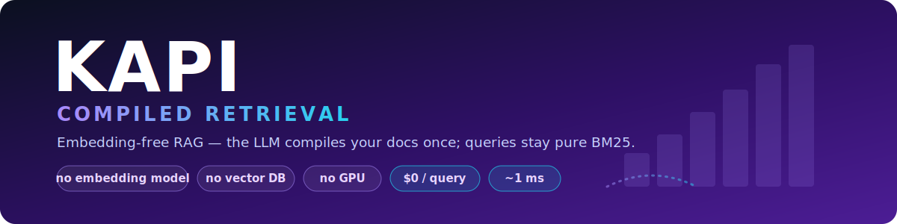
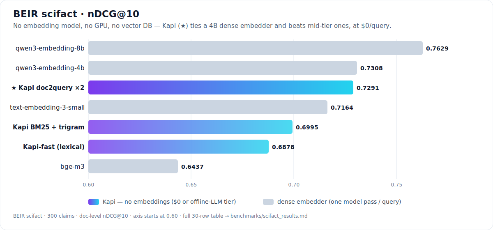
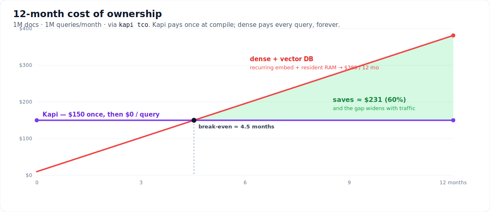
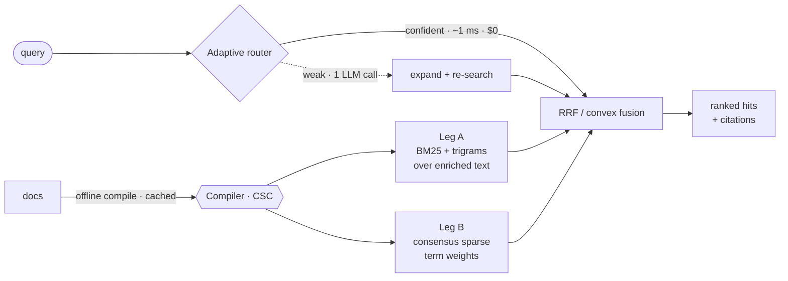

<div align="center">



<br/>


**Fast, local, zero-setup RAG with no embedding model.** The LLM compiles your documents *once, offline*; queries stay pure BM25 — **~1 ms, $0, no GPU, no vector database.**

[Performance](#performance) · [Quickstart](#quickstart) · [How to use](#how-to-use) · [Evaluation](#evaluation) · [Cost](#cost) · [How it works](#how-it-works)

</div>

---

## Performance

Can a retriever with **no embedding model** compete with dense embeddings? On **BEIR scifact** — yes.

<div align="center">

</div>

**The honest headline.** In the cost-fair tier (retrieval only, no per-query model), *Kapi doc2query×2* — **no embeddings, no GPU, no vector DB** — hits **nDCG@10 0.7291 / MRR 0.7042**. That **statistically ties `qwen3-embedding-4b`** (0.7308) and **beats it on MRR**, while clearly beating `text-embedding-3-small` and `bge-m3` — all at **`$0` per query**. Only the 8B embedder is decisively ahead. Full 30-row, cost-tiered table with ablations: [`benchmarks/scifact_results.md`](benchmarks/scifact_results.md).

And on **BRIGHT** — the reasoning-intensive benchmark where off-the-shelf dense *collapses* (the #1 MTEB model scores just **18.3**) — embedding-free is exactly where the frontier lives:

| nDCG@10 (avg) | BM25 zero-shot | **off-the-shelf dense** | BM25 + GPT-4 CoT | LATTICE (emb-free SOTA) |
|---|:--:|:--:|:--:|:--:|
| | 14.3 | **18.3** ⬇ | 27.0 | 46.7 |

Compiled Retrieval's target: **beat off-the-shelf dense at `$0` query cost**, and approach reasoning systems while staying ~1 ms.

---

## Quickstart

```bash
pip install kapi
```

```python
from kapi import Kapi

rag = Kapi(preset="fast")                      # pure lexical — no LLM, no setup, no models
rag.add_texts(["Dijkstra finds shortest paths.", "Tomato soup needs basil."])
print(rag.search("shortest path", k=1)[0].text)
# -> Dijkstra finds shortest paths.
```

That's the whole install: no model download, no Java, no GPU, no vector DB. LLM features are pure add-ons — plug one in when you want compiled enrichment and grounded answers.

---

## How to use

### 1 · Pure lexical (no LLM)

```python
from kapi import Kapi, Document

rag = Kapi(preset="fast", path="./idx")             # on-disk; omit path for in-memory
rag.add("docs/")                                    # a dir, file, glob, texts, or Documents
rag.add("report.pdf")                               # needs kapi[pdf]
rag.add_texts(["first passage", "second passage"])
rag.add([Document(doc_id="d1", text="...", source="d1.md", metadata={"team": "billing"})])

for h in rag.search("how do refunds work?", k=5):
    print(f"{h.score:.3f}  {h.source}\n   {h.text[:100]}")
rag.close()
```

### 2 · Plug in any LLM

The contract is one method, `complete`. Use the built-in OpenAI-compatible adapter, wrap a function, or pass nothing.

```python
from kapi.llm import OpenAICompatLLM, CallableLLM

# Any OpenAI-compatible endpoint: OpenAI, Ollama, vLLM, llama.cpp, LM Studio, Together, Groq...
llm = OpenAICompatLLM(base_url="http://localhost:11434/v1/", model="llama3.2", api_key="ollama")

# ...or wrap any callable (called with just the prompt string by default)
llm = CallableLLM(lambda prompt: my_model(prompt))

# ...or no LLM at all — pure lexical retrieval still works
```

### 3 · Presets

| Preset | LLM | What runs | For |
|---|:--:|---|---|
| `fast` | — | pure lexical (BM25 + trigrams + title) | sub-10 ms retrieval, no LLM |
| `quality` *(default)* | ✔ | + contextual indexing (offline) + query expansion + grounded answers | best general RAG |
| `compiled` | ✔ | + the index-time **compiler** (CSC) + the adaptive **router** | reasoning corpora, `$0` queries |

Any field is overridable: `Kapi(preset="compiled", consensus_k=5, engine="sqlite")`.

### 4 · Compiled Retrieval

> **Retrieval intelligence is a compile-time problem, not a serve-time problem.**

One cached offline pass per chunk emits an enrichment **bundle** — all plain text that lands in the lexical index, never in the cited text:

| Pillar | What the compiler adds | Prior art |
|---|---|---|
| **blurb** | a chunk-specific context sentence | Anthropic Contextual Retrieval, 2024 |
| **questions** | the queries this chunk answers | doc2query / docTTTTTquery |
| **propositions** | atomic, decontextualized facts | Dense X, EMNLP 2024 |
| **reasoning** | multi-hop bridges *not lexically present* | the BRIGHT-winning signal, precomputed |

**CSC — Consensus Sparse Compilation:** the compiler is sampled `k` times; a term's weight is its **agreement across samples** — a training-free learned-sparse weighter that doubles as a self-consistency filter (hallucinated terms appear once and are dropped; entailed terms recur and are promoted). **Literal anchoring** keeps every source-literal term (IDs, error codes) at a floor weight, so exact match is structurally protected.

```python
llm = OpenAICompatLLM(base_url="...", model="...", api_key="...")

rag = Kapi(llm=llm, preset="compiled", path="./idx")
rag.compile("docs/")                                # offline, cached by content-hash
print(rag.query("does this scale to a billion rows?").answer)

rag = Kapi.open("./idx")                             # reopen with NO llm — it still serves
```

**Adaptive router** — the only query-time LLM use, and it's gated. The first lexical pass is ~1 ms and `$0`; a cheap confidence signal decides whether to spend one LLM call escalating (expansion + re-search). Short queries are treated as precise and never escalated — dodging the expansion *precision trap*.

```python
rag.search("how can I get my money back?", k=5)
print(rag.last_route)   # RouterDecision(escalate=..., reason='no_hits'|'low_margin'|'confident', ...)
```

### 5 · Persistent, incremental, portable

```python
rag = Kapi.open("./idx", llm=llm)
rag.sync("docs/")                     # re-index only changed files; drop deleted ones
rag.remove("d1")                      # delete one document
```

**Compile once, serve anywhere (air-gapped).** The serving index is a plain lexical artifact — bundle it and ship it to an on-prem / offline box:

```bash
kapi export --index ./idx --out ship.kapi.tgz      # portable bundle (drops the LLM cache)
kapi import ship.kapi.tgz --index ./served         # unpack on the target machine
kapi query  "how do refunds work?" --index ./served   # $0, ~1 ms, no model, no network
```

Or run the **hosted compilation service** — clients POST docs, get back a serving bundle; no embedding model ever crosses the wire:

```bash
kapi serve --base-url http://localhost:11434/v1/ --model llama3.2   # POST /compile, GET /bundle/<job>
```

### 6 · Answers, citations, streaming

```python
res = rag.query("How do refunds work?", k=8)
print(res.answer)                        # grounded answer (None if no LLM)
for c in res.citations:
    print(c.marker, c.source, f"{c.score:.3f}")
for tok in rag.query_stream("How do refunds work?"):
    print(tok, end="")
```

### 7 · Drop into LangChain / LlamaIndex

```python
from kapi.integrations import to_langchain_retriever, to_llamaindex_retriever
lc = to_langchain_retriever(rag, k=5)      # a LangChain BaseRetriever
li = to_llamaindex_retriever(rag, k=5)     # a LlamaIndex BaseRetriever
```

### 8 · Command line

```bash
kapi compile ./docs --index ./idx --base-url http://localhost:11434/v1/ --model llama3.2
kapi query  "how do refunds work?" --index ./idx
kapi stats  --index ./idx
kapi tco    --queries-per-month 5000000 --months 36    # cost model (below)
```

---

## Evaluation

Kapi ships its own **cost-tiered** evaluation harness (`kapi.eval`). The rule: never compare a `$0`-per-query lexical system against one that pays a model per query without labelling the tier. Credibility is the moat.

### The metrics module (pure-Python, no deps)

`kapi.eval.ir_metrics` implements the standard IR metrics with zero dependencies — metric strings `ndcg@k`, `recall@k`, `precision@k`, `hit@k`, `mrr`, `map`.

```python
from kapi.eval import evaluate_run

qrels = {"q1": {"docA": 1, "docC": 1}}                    # ground-truth relevance
run   = {"q1": {"docA": 9.1, "docB": 4.2, "docC": 2.0}}  # your system's doc -> score
print(evaluate_run(qrels, run, metrics=("ndcg@10", "recall@10", "mrr")))
# {'ndcg@10': 0.92, 'recall@10': 1.0, 'mrr': 1.0}
```

Evaluate Kapi on your own labelled queries:

```python
rag = Kapi(preset="fast"); rag.add("corpus/")
run = {}
for qid, text in my_queries.items():
    scores = {}
    for h in rag.search(text, k=100):
        did = h.chunk_id.split("::", 1)[0]                 # chunk -> parent doc
        scores[did] = max(scores.get(did, -1e9), h.score)  # max-pool chunks
    run[qid] = scores
print(evaluate_run(my_qrels, run, ("ndcg@10", "recall@100", "mrr")))
```

### BEIR & BRIGHT runners

Install the extra (`pip install "kapi[eval]"`), then build a fresh index via a factory and score it:

```python
from kapi.eval import run_beir, run_bright, run_bright_all

# BEIR — breadth / parity, scored against the published BM25 anchor
print(run_beir(lambda: Kapi(preset="fast"), dataset="scifact", split="test"))

# BRIGHT — the reasoning-intensive hero benchmark (needs an LLM for the compiled preset)
print(run_bright(lambda: Kapi(llm=llm, preset="compiled"), subset="biology"))
results = run_bright_all(lambda: Kapi(llm=llm, preset="compiled"))   # all 12 subsets
```

**What the harness taught us — findings, not vibes:**
- **Query-side expansion is a trap on precise retrieval** — LLM query2doc (−0.015 nDCG) and RM3 (−0.14 to −0.19) both crater precision. *Enrich the corpus, never the query* — which is exactly why the router only expands weak/ambiguous queries.
- **Anticipatory indexing (doc2query) is the cost-fair lever** — the LLM writes, at index time, the claims each doc answers; queries stay pure BM25. Best no-embedding retrieval-only result, free at query time.

### Live compiled-retrieval benchmark

```bash
python benchmarks/csc_eval.py baseline                      # pure-lexical, free
OPENROUTER_API_KEY=... python benchmarks/csc_eval.py smoke   # compile a few docs; print bundle + weights
OPENROUTER_API_KEY=... python benchmarks/csc_eval.py compiled --index ./idx_csc --k 3
```

### Reproducing

```bash
pip install "kapi[eval]"
export KAPI_LLM_BASE_URL=... KAPI_LLM_MODEL=... KAPI_LLM_API_KEY=...   # any OpenAI-compatible endpoint
python -m pytest                                                        # 87 passing, 3 opt-in skipped
```

---

## Cost

Evaluation isn't only quality — it's the bill. Kapi pays the smart compute **once, at compile time**; a dense + vector-DB stack pays it on **every query, forever**, plus RAM to hold vectors resident.

<div align="center">

</div>

```bash
kapi tco --docs 1000000 --queries-per-month 5000000 --months 36
```
```python
from kapi.tco import TCOInputs, compute_tco, format_report
print(format_report(TCOInputs(), compute_tco(TCOInputs())))
```

Every rate is an overridable input (defaults cite the strategy brief) — plug in your own numbers, get your own break-even.

---

## How it works



- **Structure-aware chunking** with span-exact offsets; `indexed_text` (enriched, searched) is kept separate from `raw_text` (clean, cited).
- **Two sparse legs**, fused by RRF (zero-tuning) or convex combination — hybrid's complementarity with no dense leg.
- **Offline compiler** with a content-hash cache (re-indexing is free) and a cost guard.
- **Adaptive router** spends an LLM call only when the cheap path is unsure.

---

## Engines

Swap the lexical backend without touching anything else:

| Engine | Install | Notes |
|---|---|---|
| `tantivy` *(default)* | core | fast, persistent, multi-field scoring |
| `sqlite` | core | FTS5, zero extra deps, portable single file |
| `bm25s` | `kapi[bm25s]` | in-memory, pure-NumPy, fast batch |

```python
rag = Kapi(preset="fast", engine="sqlite", path="./idx")
```

## Install extras

```bash
pip install kapi                # core: tantivy + stemmer + http client. No models, ever.
pip install "kapi[openai]"      # openai SDK + tiktoken (exact token counts)
pip install "kapi[bm25s]"       # in-memory bm25s engine
pip install "kapi[pdf,html]"    # PDF text + fast HTML loaders
pip install "kapi[eval]"        # ranx / pytrec_eval / BEIR / RAGAS / datasets
```

## Design guarantees

- **No LLM required** — pure-lexical retrieval always works; LLM features disable by construction when no LLM is supplied.
- **All LLM cost is offline** (index-time, cached) or a single gated query-time call (the router).
- **Portable & explainable** — deterministic scores; the serving index is a plain directory you can archive and ship.

## License

MIT.
